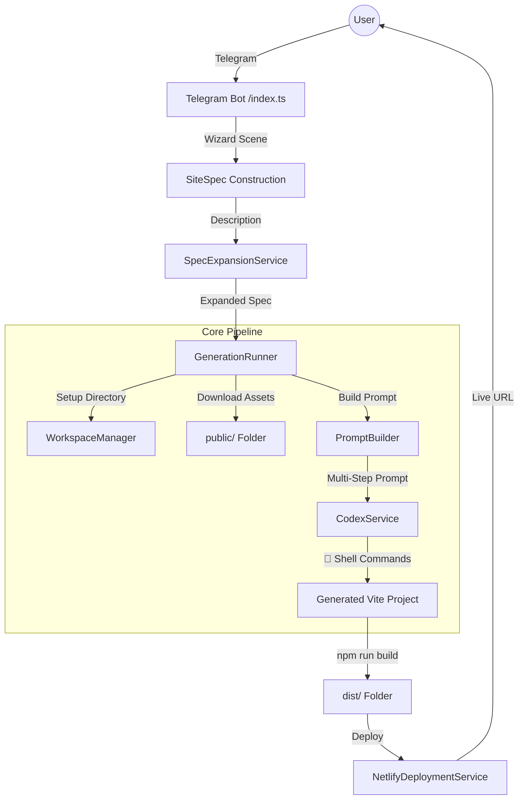

# 🏗️ System Architecture & Lifecycle

This document provides a deep dive into how Prompt2Site operates, from the first Telegram message to a live Netlify deployment.

## 🗺️ High-Level Architecture

## 🔄 The Lifecycle: Step-by-Step

### 1. The Intake Flow (Intelligent Collection)
- **Module**: `src/bot/index.ts` (using Telegraf Scenes)
- **Process**: The bot guides the user through a structured wizard. Instead of one big prompt, it collects specific metadata (Name, Subdomain, Assets). This ensures the AI has "ground truth" labels for images and the project name.

### 2. Spec Expansion (Creativity Layer)
- **Module**: `src/lib/spec-expansion-service.ts`
- **Process**: Your short prompt like "law firm site" is expanded into a detailed technical JSON (`SiteSpec`). It defines color palettes, typography, and site sections before a single line of code is written.

### 3. Preparation (Workspace Management)
- **Module**: `src/bot/workspace-manager.ts`
- **Process**: A unique directory is created. If the user uploaded images or logos, they are downloaded and placed into the `public/` folder immediately. A `.spec.json` file is saved to keep the project's configuration persistent.

### 4. Autonomous Execution (The Engine)
- **Modules**: `src/bot/prompt-builder.ts` + `src/lib/codex-service.ts`
- **Process**: 
    - `PromptBuilder` constructs a massive "System Architect" instruction.
    - `CodexService` starts the `codex exec` command with **autonomous shell access**.
    - **Codex runs the terminal**: It executes `npm create vite`, `npm install`, and writes `src/App.tsx`. It uses the local assets you uploaded by referencing them as root-relative paths (e.g., `/logo.png`).

### 5. Deployment (Final Handover)
- **Module**: `src/lib/deployment-service.ts`
- **Process**: Once Codex finishes `npm run build`, the runner triggers the Netlify deployment. It handles subdomain conflicts by automatically retrying with random suffixes if the name is taken.

---

## 🛠️ Module Roles

| Module | Role |
| :--- | :--- |
| **`index.ts`** | The "Face". Handles UX, scenes, commands, and user session state. |
| **`generation-runner.ts`** | The "Orchestrator". Connects all services in a linear pipeline. |
| **`workspace-manager.ts`** | The "Librarian". Handles file system logic, directory isolation, and metadata. |
| **`prompt-builder.ts`** | The "Strategist". Translates Specs into high-context LLM instructions. |
| **`codex-service.ts`** | The "Action Layer". Spawns shell processes and feeds instructions to Codex. |
| **`deployment-service.ts`** | The "Courier". Manages the interface with Netlify's CLI/API. |

---

## 🔄 Iterative Updates: The "Loop"
When you run `/update`:
1. **Lookup**: `WorkspaceManager` find the folder by ID.
2. **Context**: It reads the `.spec.json` to remember what was built.
3. **Targeted Change**: `PromptBuilder` creates an **Iteration Prompt** (Instruction: "Modify X, keep Y, break nothing").
4. **Precision Build**: Codex reads the existing `App.tsx`, applies *only* the change, and rebuilds the site.
