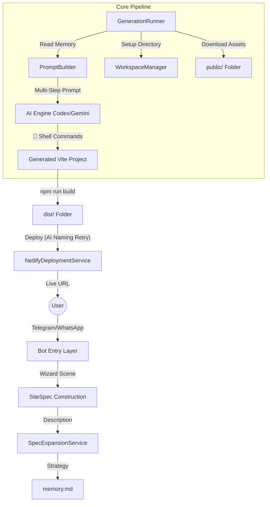

# 🏗️ System Architecture & Lifecycle

This document provides a deep dive into how Prompt2Site operates, from the first Telegram message to a live Netlify deployment.

## 🗺️ High-Level Architecture

## 🔄 The Lifecycle: Step-by-Step

### 1. The Intake Flow (Multi-Platform)
- **Module**: `src/bot/index.ts` (Telegram) & `src/bot/webhook-server.ts` (WhatsApp)
- **Process**: Users start a guided wizard. The system captures structured metadata (Name, Subdomain, Design Persona) and asset labels. 

### 2. Spec Expansion: The "Prompt Context Builder"
- **Module**: `src/lib/spec-expansion-service.ts`
- **Process**: The raw description is expanded into a strategic `SiteSpec` JSON. This service acts as a "Naming Specialist" and "Strategy Architect," generating a persistent `memory.md` file.

### 3. Strategy Persistence: `memory.md`
- **Concept**: Instead of just passing JSON, the system creates a Markdown "brain" for the AI Architect.
- **Content**: Captures the vision, brand persona, customer-facing copy strategy, and competitive research directives.
- **Updates**: During `/update`, the `memory.md` is read and updated with new historical context, ensuring the AI remembers previous decisions.

### 4. Preparation: DNS & Reliability
- **Module**: `src/bot/index.ts`
- **Process**: To prevent connection failures in regions with DNS poisoning, the bot includes a global override for `api.telegram.org` that maps directly to a hardcoded IP.

### 5. Autonomous Execution (The Engine)
- **Modules**: `src/bot/prompt-builder.ts` + `AIServiceFactory`
- **Process**: 
    - `PromptBuilder` generates high-context instructions that force the AI to read `memory.md` first.
    - **Codex** runs with **autonomous shell access**, heart-beating terminal commands to build the React project directly.

### 6. Deployment: Smart Handover
- **Module**: `src/lib/deployment-service.ts`
- **Process**: Automated build and Netlify deployment. If a subdomain is taken, the system triggers an **AI Identity Regeneration** to brainstorm a new, available slug without user intervention.

---

## 🛠️ Module Roles

| Module | Role |
| :--- | :--- |
| **`index.ts`** | The "Face". Handles UX, sessions, and DNS reliability. |
| **`generation-runner.ts`** | The "Orchestrator". Manages the pipeline and repair loops. |
| **`spec-expansion-service.ts`**| The "Strategist". Synthesizes prompts into `memory.md`. |
| **`workspace-manager.ts`** | The "Librarian". Handles file system logic and metadata (Deletion Disabled). |
| **`prompt-builder.ts`** | The "Translator". Turns strategy into actionable LLM instructions. |
| **`deployment-service.ts`** | The "Courier". Manages Netlify and team detection. |
| **`version-service.ts`** | The "Archivist". Handles Git-based versioning and site reverts. |

---

## 📦 Git-Based Versioning & Reverts
The system implements a sophisticated versioning strategy to ensure every successful build is safely archived and reversible.
- **Tagging Strategy**: Each site uses its own tag namespace: `<site-slug>/v1`, `<site-slug>/v2`.
- **Initialization**: Upon the first successful deployment, the `VersionService` initializes Git tracking for the site folder, commits the code, and tags it as `v1`.
- **Iteration**: Every `/update` that results in a successful build triggers a new commit and a version increment (v2, v3, etc.).
- **Reverts**: When a user triggers a revert, the system:
  1. Performs a `git checkout` of the specific site folder from the target tag.
  2. Commits this "restored" state as the *next* sequential version (e.g., v3 might be a revert to v1).
  3. Rebuilds and redeploys the restored code to Netlify.

---

## 🩹 Recursive Repair Loop: The Safety Net
If the `npm run build` step fails:
1. **Detection**: `GenerationRunner` catches the non-zero exit code.
2. **Log Extraction**: It captures the last 50 lines of the terminal output.
3. **Repair Prompt**: A specialized prompt is sent to Codex: "Analyze these logs, fix the error in the source code, and rebuild."
4. **Retry**: Codex has one attempt to fix its own mistake before reporting a final failure.

---

## 🔄 Iterative Updates: The "Loop"
When you run `/update`:
1. **Context Loading**: `WorkspaceManager` loads existing metadata and `memory.md`.
2. **Strategy Update**: `SpecExpansionService` updates the memory with new instructions.
3. **Multi-modal Input**: New images are downloaded into the project's `public/` folder.
4. **Precision Build**: Codex modifies existing components and rebuilds while adhering to the original design system found in `memory.md`.

---

## 🔒 Safety & Constraints
- **Site Deletion**: Intentionally disabled in `WorkspaceManager` to preserve user data and history.
- **Brand Embodiment**: The AI is forbidden from using meta-commentary (e.g., "The reference site says..."). It must speak as the brand owner.
